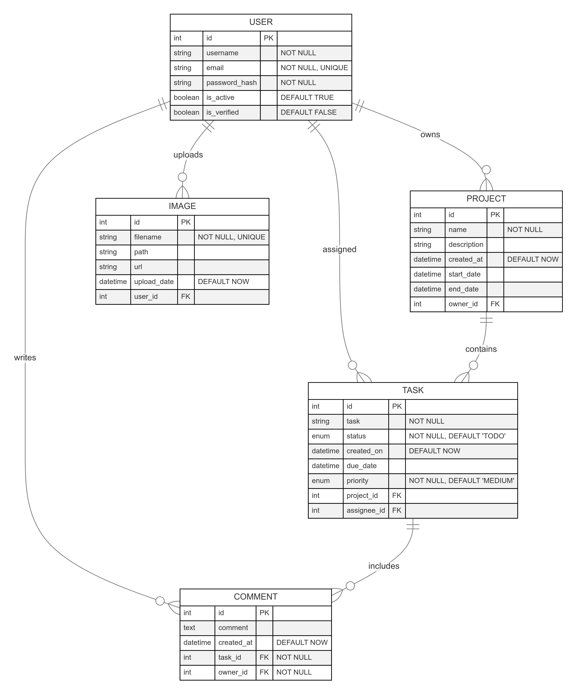

# Project Management App Documentation

## Table of Contents

- [Introduction](#introduction)
- [Features](#features)
- [Technologies Used](#technologies-used)
- [Project Structure](#project-structure)
- [Installation](#installation)
- [API Documentation](#api-documentation)
- [Authorization](#authorization)
- [Password Hashing and Validation](#password-hashing-and-validation)
- [Token Handling](#token-handling)
- [Database Migrations](#database-migrations)
- [Sequence Diagram](#sequence-diagram)
- [ERD Diagram](#erd-diagram)

## Introduction

The Project Management App is a FastAPI-based web application designed to efficiently manage projects, tasks, and team collaboration. It features robust user authentication, role-based access control, real-time comment management with WebSocket support, and comprehensive project tracking. The app is built with a PostgreSQL backend, providing a scalable and secure environment for managing multiple projects and teams within an organization.

## Features

- **User Authentication:** Secure user authentication using JWT, ensuring only authorized users can access the app.
- **Project Management:** Create, update, and track projects with detailed timelines and statuses.
- **Task Management:** Assign, prioritize, and monitor tasks with status tracking and deadlines.
- **Comment Management:** Real-time commenting on tasks and projects with WebSocket functionality for seamless communication.

## Technologies Used

- **FastAPI:** A modern, fast (high-performance), web framework for building APIs with Python.
- **SQLAlchemy:** SQL toolkit and Object-Relational Mapping (ORM) for Python.
- **PostgreSQL:** Open-source relational database.
- **uvicorn:** ASGI server for running FastAPI applications.
- **Pydantic:** Data validation and settings management using Python type hints.
- **OAuth2:** Authorization framework used for securing API endpoints.
- **JWT (JSON Web Tokens):** Compact, URL-safe means of representing claims between two parties.

## Project Structure

```plaintext

Project-Management-App/
├── config/
|   ├── config.py
│   ├── database.py
│   ├── enumeration.py
│   └── __init__.py
│
|── images/
│   └── xxxx-xxxx-xxxx.png
|
├── models/
│   ├── images.py
│   ├── users.py
│   ├── projects.py
│   ├── tasks.py
│   ├── comments.py
│   └── __init__.py
│
├── schemas/
│   ├── user_payload.py
│   ├── project_payload.py
│   ├── task_payload.py
│   ├── comment_payload.py
│   ├── image_payload.py
│   └── __init__.py
│
├── repository/
│   ├── user_repository.py
│   ├── project_repository.py
│   ├── task_repository.py
│   ├── comment_repository.py
│   ├── image_repository.py
│   ├── repository.py
│   └── __init__.py
│
├── service/
│   ├── user_services.py
│   ├── project_services.py
│   ├── task_services.py
│   ├── comment_services.py
│   ├── image_services.py
│   └── __init__.py
│
├── router/
│   ├── api.py
│   └── v1/
│       ├── user.py
│       ├── project.py
│       ├── task.
│       ├── comment.py
│       └── __init__.py
├── utils/
│   ├── sockets
│   │   ├── handler.py
│   │   ├── manager.py
│   │   ├── notification.py
│   │   └── __init__.py
│   ├── tokens
│   │   ├── hash.py
│   │   ├── jwt_handler.py
|   │   ├── reset_password.py
│   │   └── __init__.py
│   ├── email_utils.py
│   └── __init__.py
├── .env
├── requirements.txt
├── alembic.ini
├── docker-compose.yml
├── Dockerfile
├── __init__.py
└── main.py


```

## Installation

To run the Project Management App locally, follow these steps:

### 1. Clone the Repository

```bash
git clone https://github.com/NirnayaT/Project-Management-App.git
cd project-management-app
cd server
```

### 2. Set Up Virtual Environment (Optional but Recommended)

Before running the application, it is advisable to set up a virtual environment to manage dependencies. Follow the steps below:

1. Open a terminal in the project directory.
2. Create a virtual environment using the following command:

   ```bash
   python -m venv venv
   ```

3. Activate the virtual environment:

   - On Windows:

     ```bash
     .\venv\Scripts\activate
     ```

   - On macOS and Linux:

     ```bash
     source venv/bin/activate
     ```

4. With the virtual environment activated, install the required dependencies:

   ```bash
   pip install -r requirements.txt
   ```

### 3. Run the Application

To run the Project Management App, follow these steps:

1. Open a terminal in the project directory.
2. Make sure your virtual environment is activated.
3. Run the following command:

   ```bash
   uvicorn main:app --reload
   ```

4. Access the Swagger UI at [http://localhost:8000/docs](http://localhost:8000/docs) or ReDoc at [http://localhost:8000/redoc](http://localhost:8000/redoc) to explore the API.

5. The application is now running, and you can interact with the Project Management App through the provided API.

## Database Migrations

1. Update the database connection details in main.py.
2. Run migrations:
   `alembic upgrade head`

## Database schema

The application utilizes PostgreSQL in conjunction with SQLAlchemy for managing its database. The schema consists of tables for users, leave requests, and roles.

1. To view database details, access the PostgreSQL terminal with the following command:

```
psql -U [db_user]
```

## API Documentation

The postman collection is also included in the repo.
[Postman Collection](./FastAPI.postman_collection.json)


## Password Hashing and Validation

The application uses the bcrypt hashing algorithm to securely store passwords. The `hash_password` function hashes passwords, and the `verify_password` function checks the validity of passwords.

## Token Handling

- The `create_access_token` function generates access tokens with expiration times.
- The `get_current_user` function decodes the access token and retrieves the current user.
- The `get_current_active_user` function ensures that the current user is active before processing requests.


## Authorization

The application implements single role control using OAuth2 and JSON Web Tokens (JWT). Users must authenticate to obtain an access token, which is then used to access secured endpoints. Roles aren't defined yet.


## Sequence Diagram


## ER Diagram


